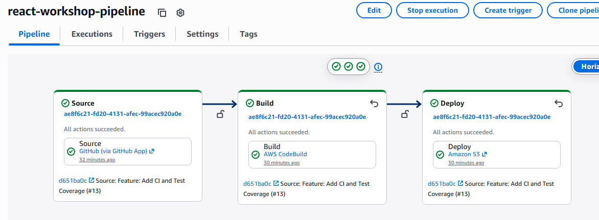
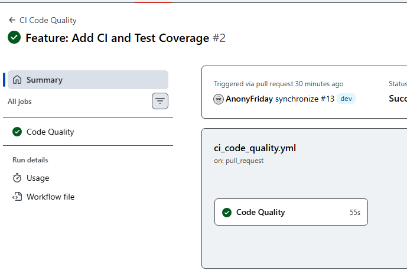
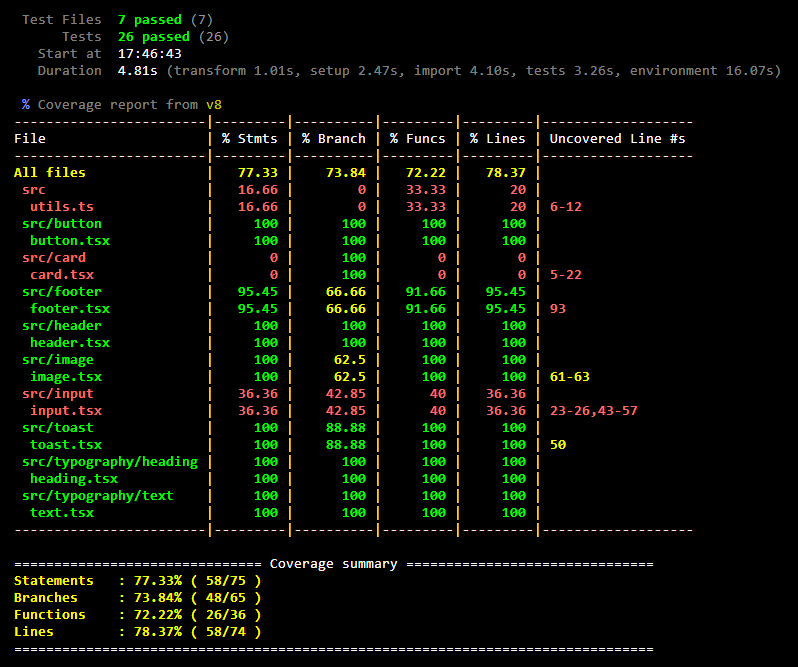
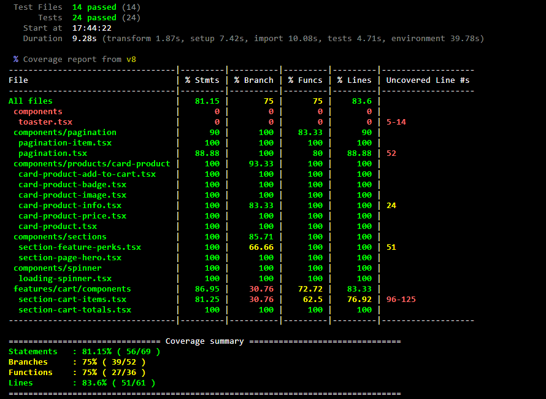

# React Workshop 2026

React 19 + Vite monorepo starter with pnpm, Turborepo, Storybook, TanStack Query, React Hook Form, Tailwind CSS, and shared packages.

## Figma design

<https://www.figma.com/design/QFZc37IcA93Y60Zi1kbYsz/eCommerce-Website-%7C-Web-Page-Design-%7C-UI-KIT-%7C-Interior-Landing-Page--Community-?node-id=0-1&p=f&t=qazEdbbLf2KnueQT-0>

## Deployed on AWS Cloude

- Deployed URL:
  - https://d21r7zpgnuyfp4.cloudfront.net/
- Services:
  - S3 bucket for hosting static files
  - AWS CodePipeline
  - AWS CodeBuild
  - AWS CloudFront



## Achieved criteria

### Functional and UI

- ✅ Home page
- ✅ Product detail page
- ✅ Shop page
- ✅ Cart page
  - Support storing cart state using Zustand
- ✅ Contact page
- ✅ About page
- ✅ Checkout page

### Code Quality

- The CI pipeline include the following checking:
  - Linting
  - Typecheck
  - Test
  - Build



### Testing

#### `@react-workshop/ui` Package Coverage



#### `@react-workshop/web` App Coverage



## Getting Started

```bash
pnpm install
pnpm dev
```

## Scripts

- `pnpm dev` - run all development tasks through Turborepo
- `pnpm build` - build apps and packages
- `pnpm lint` - lint all workspaces
- `pnpm typecheck` - type-check all workspaces
- `pnpm test` - run tests across all workspaces
- `pnpm test:coverage` - run test coverage across all workspaces
- `pnpm storybook` - run the UI package Storybook

## Workspace Structure

- `apps/web` - Vite React app
- `packages/ui` - shared UI components developed with Storybook
- `packages/http-client` - shared typed fetch client
- `packages/eslint-config` - shared ESLint flat configs
- `packages/tsconfig` - shared TypeScript configs
